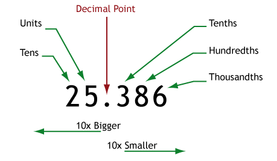

# 【基础数字】在英语中的表述

#### 1. 自然数
> 1,2,3,4,5,6,7,8,9,10...

- 自然数：`natural numbers` or `counting numbers`

#### 2. 整数
> ...,-3,-2,-1, 0 ,1,2,3...

- 整数：`integers`
- 负数读法示例: `minus one`、`minus two`...

#### 3. 有理数/分数
> 3/4, 192/3,451

- 有理数： `rational numbers`
- 分数：`fractions`
- 3/4： `three over four` or `three quarters`

#### 4. 小数/浮点数
> 78.94

- 小数： `decimal number`
- 浮点数： `floating point number`

#### 5. 实数
> π 3.141592653...

- 实数：`real number`
