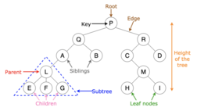
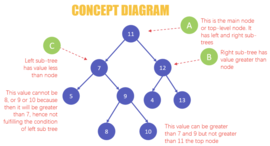

# 【二叉树及二叉搜索】词汇

> 原文：[Understanding Binary Search Trees](https://dev.to/christinamcmahon/understanding-binary-search-trees-4d90)

<h4> Definition </h4>

 Trees are a `non-sequential` data structure that is useful for storing information that needs to be found easily.  
 In other words, they are an abstract model of a `hierarchical structure` (think of a family tree).   
 Trees consist of nodes with a `parent-child relationship`.

A binary search tree (BST) is a binary tree.   
The `key difference` is that a BST only allows you to store nodes with lesser value on the left side and nodes with greater value on the right. 

<h4> Methods </h4>

- insert
- traverse
- search
- remove

例句：
1. To `insert` a new node into a tree, there are two steps we will do. (要在树中插入一个新节点，我们将执行两个步骤。)
2. `Traversing` a tree is the process of visiting all the nodes in a tree and `performing` an operation at each node.(遍历树是访问树中的所有节点并在每个节点上执行操作的过程。)  
   a). in-order traversal (中序遍历) 
   b). pre-order traversal (前序遍历)
   c). post-order traversal (后序遍历)
3. The `remove` method is the most complex method we will cover in this article.(“remove”方法是我们将在本文中讨论的最复杂的方法)
4. In our implementation, node represents the current node and data represents the value we are `searching for`.(在我们的实现中，node表示当前节点，data表示我们正在搜索的值)

