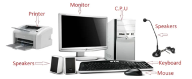

# 常见【计算机设备】英文表述

#### Input Devices

|  图片  | 英文  |  中文  |
|  ----  | ----  |  ---- |
|    | keyboard   | 键盘 |
|       | Mouse | 鼠标 |
|  | Microphone | 扩音器，麦克风 |
|  | Web Camera | 网络摄像头 |
|     | Scanner    | 扫描器 |

#### Processing Device

|  图片  | 英文  |  中文  |
|  ----  | ----  |  ---- |
|   | Central Processing Unit (CPU). | 句号 |

#### Output Devices:

|  图片  | 英文  |  中文  |
|  ----  | ----  |  ---- |
|   | Monitor | 显示器 |
|   | Printer | 打印机 |
|  | Speakers   | 扬声器 |
| | Headphone  | 双耳式耳机 |

#### Storage Devices:

|  图片  | 英文  |  中文  |
|  ----  | ----  |  ---- |
|     | Hard Disk | 硬盘 |
|  | Floppy Disk | 软盘 |
| - | Compact Disc (CD)   | 光碟机 |

