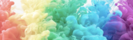

# 【趣味俚语】Idioms about Colors

<h5>1. see through rose-tinted glasses</h5>

`look at/see something/someone through rose-tinted spectacles`

**释义：**
“透过玫瑰色眼镜”,形容 “某人过于积极、乐观，只看到事物最好的一面”，多用于暗示实际情况比想象中的要糟糕.

**例句：**
Mandy sees life through rose-tinted spectacles. Despite all the world’s problems, she believes that things can only get better.  
曼蒂只能看到生活如意的一面。尽管世界存在种种问题，但她相信事情只会变得更好。

<h5>2. to give the green light</h5>

**释义：**
permission to start or continue something.

**例句：**
His boss finally gave him the green light to start the new project.  
他的老板终于允许他启动新项目。

<h5>3. with flying colors</h5>

**释义：**
成绩优异地, 出色地.

**例句：**
My daughter passed her exams with flying colours! We're going out to celebrate tonight.

<h5>4. tickled pink</h5>

**释义：**
非常開心.

**例句：**
I was tickled pink by the compliments.

<h5>5. paint the town red</h5>

**释义：**
大肆狂欢.

**例句：**
Because of graduation from college, Miss Chen is going to paint the town red with her friends next week.  
(译文：因为大学毕业，陈小姐打算和她的朋友于下个周末大肆狂欢。)

<h5>6. blue-/white-collared worker</h5>

**释义：**
蓝领/白领

<h5>7. see things in black and white</h5>

**释义：**
把事情看得一清二楚

**例句：**
See things in black and white    
所有的事情在腦海中如黑白電影般掠過

<h5>8. out of the blue</h5>

**释义：**
出乎意料地, 突然

**例句：**
Every few weeks, some thoughtful gesture out of the blue.

<h5>9. once in a blue moon</h5>

**释义：**
千载难逢

**例句：**
I see her once in a blue moon.    
我难得看到她. 

<h5>10. grey area</h5>

**释义：**
灰色地带

**例句：**
Between clear-cut success and failure there lies a large grey area.    
在明显的成功和失败之间存在着巨大的灰色地带。

<h5>11. white lie</h5>

**释义：**
善意的谎言

**例句：**
So I feel guilty every time I tell even a little white lie, although I do it just to make somebody feel better.  
因此，每当我说一点谎，即便是为了让某人感到好受一点而说谎的时候，我都好像做错了事一样。

<h5>12. green with envy</h5>

**释义：**
妒忌

**例句：**
He was green with envy when he saw my new Jaguar car.  
看见我那辆美洲虎牌新车，他非常妒忌。
